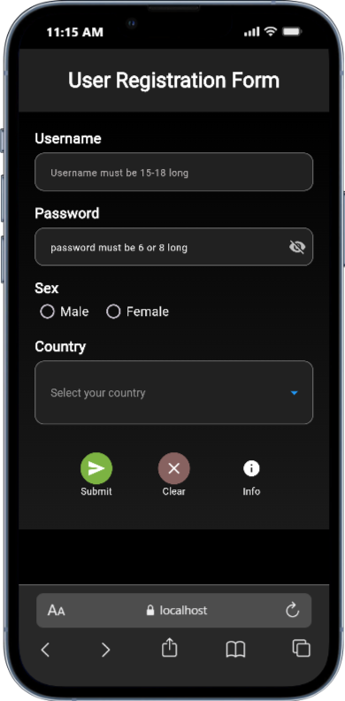
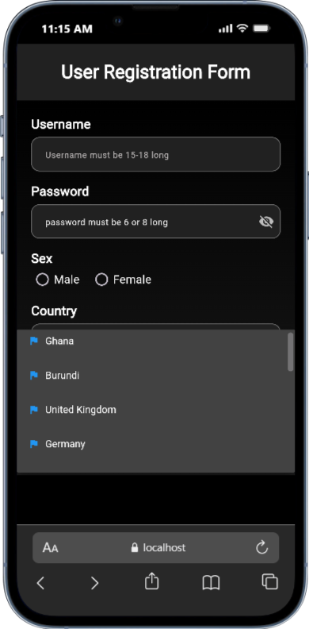
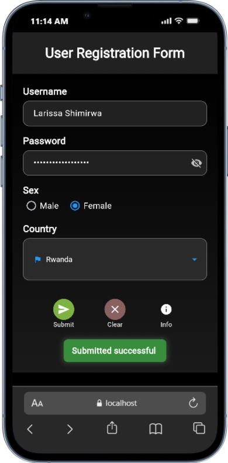

# Flutter User Registration Form

A dark-themed Flutter application featuring a user registration form with custom widgets including a country dropdown and custom icon buttons.

## Run Instructions

```bash
flutter pub get
flutter run
```

## Custom Widgets

### CountryDropdown

- **selectedCountry**: Currently selected country value
- **onChanged**: Callback function triggered when selection changes
- **countries**: Static list of 15 predefined countries

### CustomIconButton

- **icon**: IconData for the button display
- **onPressed**: Callback function for button press events
- **backgroundColor**: Different background colord depending on the icon

## Screenshot

()
()
()

### Presentation date: 7th/10/2025
